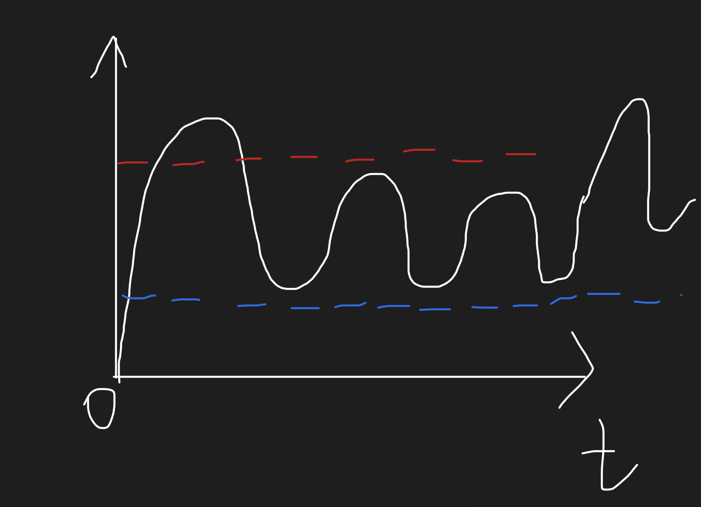

# 剖析爱情

这段时间我一直在想，在爱情中责任感究竟是不是一个“好东西”。

- 说它不好，是因为我有时觉得，只有当不够爱了，才需要责任感来继续维系感情。

- 说它好，是因为热烈的爱终将回归平淡，这时外界的刺激就会大于这个已经不那么热烈的爱，这时候责任感就成了必需品。

可是当一方仍旧热烈，一方已经平淡该怎么办呢？平淡的一方能否用责任感回应好热烈的爱呢，答案是**不能**。

可是一个人的热烈和平淡应该是**周期性的**，或者是**随机性的**。当双方当下的态度不对等的时候就会产生矛盾。

我们应该怎样解决这个问题？首先强迫自己永远保持热烈或是平淡是**不可能的**。这是**无法避免的**。

1. （激发热烈状态）刷新周期：常见面，常做浪漫的事，这些会让本身处于热烈状态的人延长热烈、让本身处于平淡的人转变为热烈。

2. （阻止平淡状态）淡化失望：失望是热烈的一方常会产生的情绪，积累多了就会影响感情。**（千万注意：这是无法避免的，一定会发生的，不要试图去阻挡失望的产生，这样平淡的一方一定会疲惫不堪！！！）**事实上，如果在失望刚刚产生的时候，另一方说两句好话，或是其他微不足道的事情，但无论是什么，这都是一件很简单的事情，却可以让失望快速减退，以至于它不会累积到“失望槽”中。

纵坐标为情感热烈程度，横坐标为时间。我们的感情，一定会随着时间的推移，而不如一开始那么剧烈，即使偶尔会掀起一次高潮，但也会回归正常范围。

红色的线是外界的刺激，或者说这里才是责任感该在的地方。外界的刺激始终在那里诱惑我们，例如来自真正身边人的诱惑、来自短视频的文案（有多少是不符合实际或是极少数的情况呢？）、来自朋友圈其他人的幸福（谁会炫耀不幸呢？）。责任感使我们不去放弃这段感情，并依然爱着对方。

蓝色的线是感情的底线。如果一份爱情经历过半年、一年、两年（因人而异）的时间，那么他们一定经历过数次不对等的情感状态冲突而没有离开彼此。底线是会随着时间而逐步上升的，这是感情自然升温的结果。

* 我们常常误认为感情升温会导致黑线的上层凸得更高，但其实是蓝色线变高了；
* 我们常常误认为责任感是蓝色的线，但其实是红色的线。

**责任感不是给我们兜底的。**